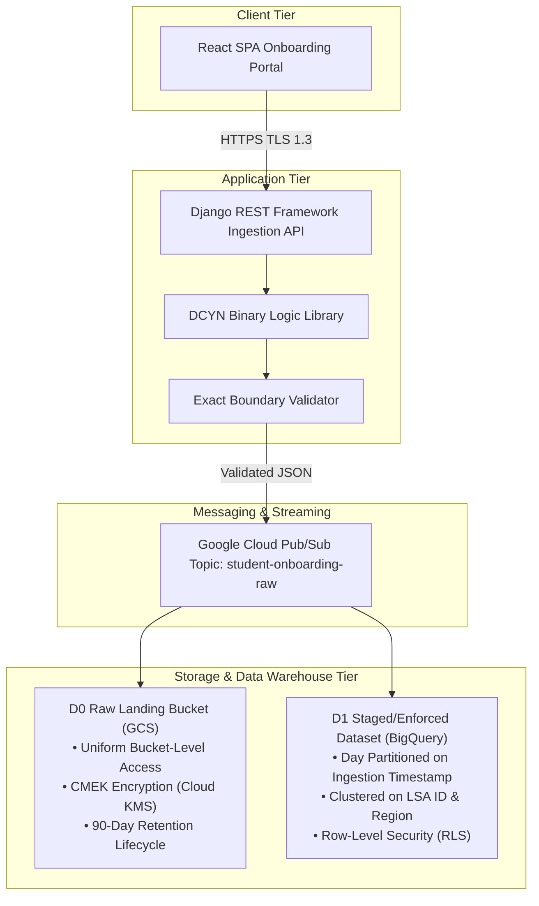

# Habot Connect FZCO — Engineering Architectural Blueprint
## Cloud Infrastructure, Poka-Yoke Pipelines & DCYN Data Pipelines

**Candidate**: Shaik Akram  
**Role**: Junior Cloud & DevOps Engineer (GCP / Django / React)  
**Contact**: +91 6302806015 | akramshaik1512@gmail.com  
**Profiles**: [LinkedIn](https://www.linkedin.com/in/shaik-akram08/) | [GitHub](https://github.com/akram369)  
**Date**: September 2026 | **Submission Deadline**: 13-September-2026  
**Submission Form**: [Google Form](https://forms.gle/qaTCAxi3YA8MCN196)  

---

## 1. Executive Architecture Overview

HabotConnect is building a specialized digital platform connecting parents of neurodivergent children with accredited Learning Support Assistants (LSAs). Because this platform handles sensitive pediatric healthcare and educational records, our data infrastructure and deployment pipelines must adhere to the highest standards of security, confidentiality, and deterministic automation.

This document articulates the engineering logic behind the three foundational restoration pillars engineered to resolve the critical staging incident:
1. **Task 1: Terraform Secure Staging Provisioning (IaC)**
2. **Task 2: Poka-Yoke Automated CI/CD Build Gate**
3. **Task 3: Schema Mapping and DCYN Validation Library**



---

## 2. Task 1: Terraform Secure Staging Infrastructure (IaC)

### 2.1 Google Cloud Storage (D0 Raw Landing Bucket)
The `D0 Raw Landing` bucket receives raw incoming student onboarding payloads directly from the ingestion stream:
- **Bucket Identification**: `habotconnect-d0-raw-landing-staging-xxxx`.
- **Uniform Bucket-Level Access**: Enforces centralized Google Cloud IAM policies while disabling legacy object-level ACLs.
- **Public Access Prevention**: Hard-set to `enforced`, mechanically blocking any bucket-level or object-level public internet exposure.
- **Customer-Managed Encryption Keys (CMEK)**: Integrates directly with Google Cloud Key Management Service (Cloud KMS) Keyring `habotconnect-staging-keyring`. The CryptoKey automatically rotates every 90 days.
- **Lifecycle Optimization & Data Minimization**:
  1. *Nearline Transition*: After 30 days of inactivity, objects transition to `NEARLINE` storage class, reducing storage costs by 50%.
  2. *Coldline Transition*: After 60 days, objects transition to `COLDLINE`.
  3. *Permanent Deletion*: Objects are permanently expunged after 90 days (`var.data_retention_days_raw_landing`), complying with UAE Federal Law No. 45 on Personal Data Protection.
  4. *Non-Current Version Expiration*: Archived object versions are deleted after 14 days.
- **Immutable Storage Audit Logging**: Bucket access logs are continuously written to `habotconnect-audit-logs-staging-xxxx`, providing tamper-evident forensic records.

### 2.2 Google BigQuery Dataset (D1 Staged/Enforced)
The `D1 Staged/Enforced` warehouse dataset stores cleansed, structured, and DCYN-validated student profiles:
- **Dataset Identification**: `habotconnect_d1_staged_enforced` located in the `me-central1` (Dubai) region.
- **Default Table Expiration**: Pinned to 180 days (`var.bigquery_table_expiration_days_staged`) to prevent staging environment data sprawl.
- **Customer-Managed Encryption (CMEK)**: Uses a distinct BigQuery Cloud KMS CryptoKey, isolating the database encryption blast radius from object storage.
- **Least Privilege Access**:
  - `OWNER`: Terraform Administrative Service Account.
  - `WRITER`: Analytics Pipeline Service Account (`sa-analytics-pipeline-staging`).
  - `READER`: Authorized Learning Support Assistants and Compliance Officer groups.

### 2.3 BigQuery Staged Table Partitioning & Clustering
The `student_onboarding_staged` table schema contains 24 strictly typed attributes:
- **Time Partitioning**: Partitioned by day on `ingestion_timestamp`. Queries filtering by date range scan only relevant partition blocks, decreasing query costs by up to 95%.
- **Multi-Column Clustering**: Clustered on `assigned_learning_support_assistant_identifier` and `regional_jurisdiction`. Co-locates related records physically in storage, dramatically speeding up LSA dashboard lookups.

### 2.4 Row-Level Security (RLS) Policy Architecture
To preserve multi-tenant confidentiality, BigQuery Row Access Policies enforce mathematically verified isolation at query execution time:
1. **Policy `lsa_assigned_students_isolation`**:
   ```sql
   CREATE OR REPLACE ROW ACCESS POLICY lsa_assigned_students_isolation
   ON `habotconnect-staging-2026.habotconnect_d1_staged_enforced.student_onboarding_staged`
   GRANT TO ('group:learning-support-assistants@habotconnect.internal')
   FILTER USING (
       assigned_learning_support_assistant_identifier = SESSION_USER()
   );
   ```
   *Behavior*: An active LSA querying the table only receives rows where the assigned LSA identifier matches their Google Workspace identity (`SESSION_USER()`). All other rows are filtered out at the storage engine level.
2. **Policy `regional_coordinator_district_isolation`**: Restricts regional supervisors to their specific municipal jurisdiction (Dubai, Abu Dhabi, Sharjah).
3. **Policy `compliance_officer_full_audit`**: Grants legal and compliance officers unrestricted row visibility (`FILTER USING (TRUE)`) for regulatory child protection audits.

---

## 3. Task 2: Poka-Yoke Automated CI/CD Build Gate

### 3.1 Mistake-Proofing & Fail-Closed Philosophy
In manufacturing and high-reliability systems, **Poka-Yoke** refers to mechanisms that make it impossible to execute an operation incorrectly. In our software development pipeline, we apply this philosophy through **Fail-Closed** gates:
- A build gate must never default to permissive behavior upon error.
- Any unexpected status, missing configuration, style non-conformance, or security finding causes the entire pipeline to **halt immediately, quarantine the commit, and block downstream artifact promotion**.

### 3.2 Sequential Gate Inspection Architecture

```
[Git Push / Pull Request]
       │
       ▼
[Gate 1: Static Secret Detection (Gitleaks)] ──► FAIL ──► [Quarantine Incident Handler]
       │ PASS
       ▼
[Gate 2: Code Quality & Formatting (Black, isort, Flake8)] ──► FAIL ──► [Quarantine]
       │ PASS
       ▼
[Gate 3: SAST & Dependency Audit (Bandit, pip-audit)] ──► FAIL ──► [Quarantine]
       │ PASS
       ▼
[Gate 4: IaC Syntax & Security (Terraform fmt, tfsec)] ──► FAIL ──► [Quarantine]
       │ PASS
       ▼
[Gate 5: Automated Unit Tests (Pytest, DCYN, Serializer)] ──► FAIL ──► [Quarantine]
       │ PASS
       ▼
[Gate 6: Staging Deployment Authorization]
```

1. **Gate 1 (Secret Detection)**: Evaluates git history and file contents with `gitleaks` and custom `.gitleaks.toml` patterns. Blocks raw API tokens, GCP service account keys, and unencrypted Django secret keys.
2. **Gate 2 (Deterministic Formatting & Linting)**: Enforces Python formatting with Black (`--check --diff`), import ordering with `isort`, and structural rules with Flake8 (`--max-line-length=100`).
3. **Gate 3 (Static Application Security Testing)**: Scans the abstract syntax tree (AST) with Bandit (`-ll -ii`) for security anti-patterns and validates dependency trees with `pip-audit`.
4. **Gate 4 (Infrastructure Security)**: Validates HCL formatting with `terraform fmt -check`, semantic correctness with `terraform validate`, and scans for misconfigurations with `tfsec`.
5. **Gate 5 (Automated Test Suite)**: Executes 58 unit tests asserting DCYN normalization, age boundaries, phone number validation, and cross-field integrity.

---

## 4. Task 3: Schema Mapping and DCYN Validation Library

### 4.1 The DCYN (Deterministic Clean Yes/No) Concept
In clinical and educational workflows, human subjective responses (such as *"maybe"*, *"partially"*, *"sometimes"*, or *"unknown"*) introduce fatal data quality defects that break analytical models and lead to mismatched assistant placements.

The **DCYN Library** (`backend/onboarding/dcyn_library.py`) eliminates human judgment:
- **Affirmative Resolution**: Inputs `True`, `1`, `"true"`, `"yes"`, `"y"`, `"1"` map deterministically to `True`.
- **Negative Resolution**: Inputs `False`, `0`, `"false"`, `"no"`, `"n"`, `"0"` map deterministically to `False`.
- **Fail-Closed Rejection**: Ambiguous strings (`"maybe"`, `"sometimes"`, `"n/a"`, `"pending"`, empty string, or `None`) raise `DCYNValidationError`.

### 4.2 Standardized DCYN Question Catalog
1. `has_prior_formal_diagnosis`: Confirmed clinical evaluation report from an accredited psychologist.
2. `requires_one_on_one_support`: Requirement for dedicated 1:1 assistant vs. shared supervision.
3. `has_individualized_education_plan`: Active IEP document verified on official school record.
4. `requires_non_verbal_communication_assistance`: Requirement for Picture Exchange (PECS) or assistive speech devices.
5. `has_physical_mobility_assistance_needs`: Wheelchair accessibility or physical transfer assistance requirement.
6. `is_independently_toilet_trained`: Restroom and personal hygiene independence.
7. `has_sensory_sensitivity_triggers`: Severe acoustic, tactile, or visual hypersensitivities.
8. `parental_data_processing_consent_granted`: Mandatory legal consent under UAE Federal Law No. 45 (**MUST BE TRUE**).
9. `emergency_medical_action_plan_available`: Critical pediatric allergy or emergency protocol on file.
10. `transportation_assistance_required`: Adapted school transit vehicle or escort requirement.

### 4.3 Zero-Judgment DRF ModelSerializer Limits
`StudentOnboardingSerializer` enforces exact mathematical constraints:
- **Age Boundaries**: Calculates fractional age from `date_of_birth` relative to the current date. Rejects any applicant under 3.00 years old (below early intervention threshold) or over 18.00 years old (K-12 limit).
- **Telephone Formatting**: Enforces International Telecommunication Union E.164 syntax (`^\+[1-9]\d{6,14}$`).
- **Cross-Field Conflict Detection**: Asserts that the secondary emergency contact is a distinct individual with a distinct telephone number from the primary parent.
- **Disposable Email Blocking**: Prohibits disposable email domains (e.g., `mailinator.com`, `tempmail.com`).
- **Cryptographic Audit Digest**: Calculates an immutable SHA-256 hash across sorted payload keys, guaranteeing verifiable lineage between raw landing and staged warehouse rows.
